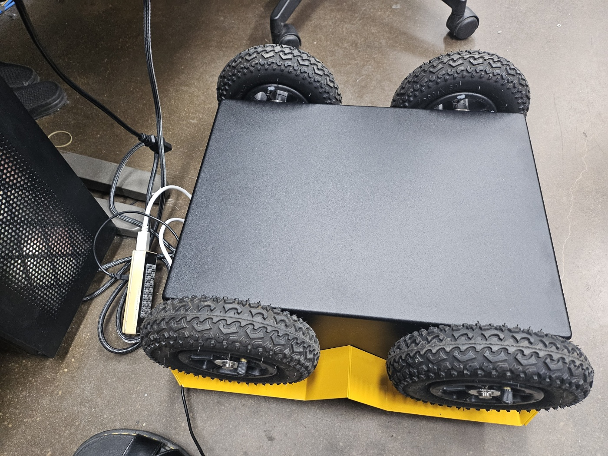
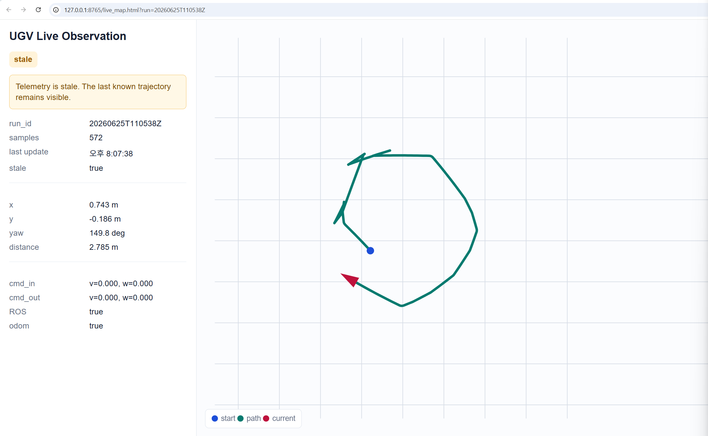

# June 2026 UGV bench notes

This page summarizes a June 29, 2026 project report. It records a limited hardware connectivity and observation check from the broader research workspace. It does not establish autonomous driving performance or validate this public repository on the physical platform.

## What was checked

The report describes a Jackal UGV with a Jetson AGX Xavier running Ubuntu 20.04 and ROS 1 Noetic. A lab control computer connected to the robot over a local network. The work confirmed remote access, ROS topic discovery, odometry/status visibility, and the command path through the robot's velocity multiplexer to its controller. The report then records low-speed manual WASD commands with the **robot inverted and its wheels off the ground**. It reports a successful wheel-response and stop check under that bench setup.

The report also describes a local 2D observation page for trajectory and command state. The captured screen below shows the last known trajectory retained while telemetry is marked **stale**. This is useful evidence for an observability requirement: an operator must be able to distinguish a current state from an old one.

## Boundary between checked and proposed work

| Checked in the report | Described as a future research direction |
| --- | --- |
| Remote connection and ROS topic inspection | Model-generated action candidates |
| Manual low-speed wheel commands on an inverted robot | Supervisor review of those candidates |
| Odometry/command visualization | Full autonomous navigation and measured safety outcomes |

The report sketches a future path from AI proposals through safety checks to bounded robot commands. Those sketches are plans, not results of the June bench check. No local network addresses, host credentials, raw telemetry logs, or full weekly report are included here.
